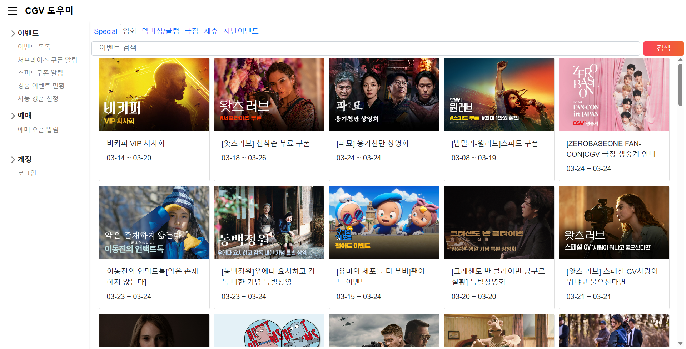
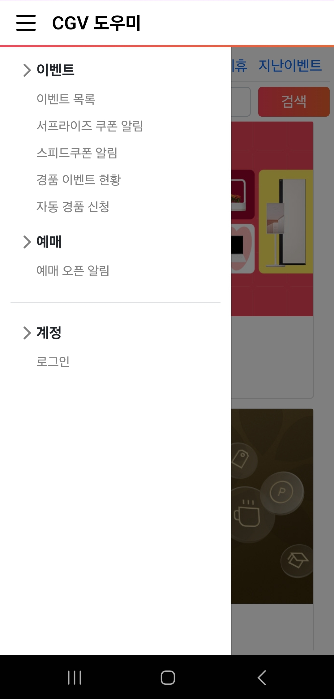
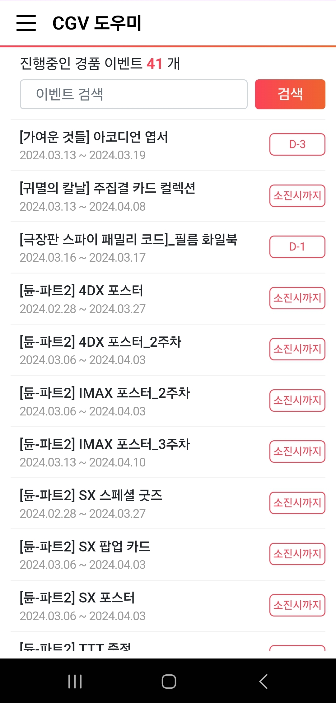
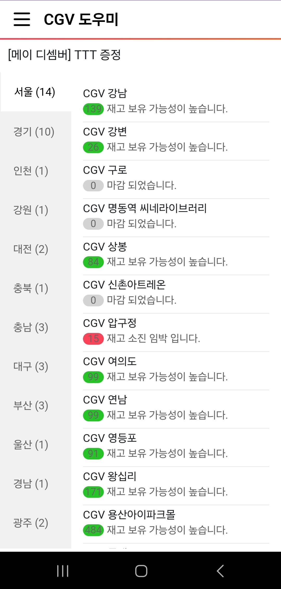
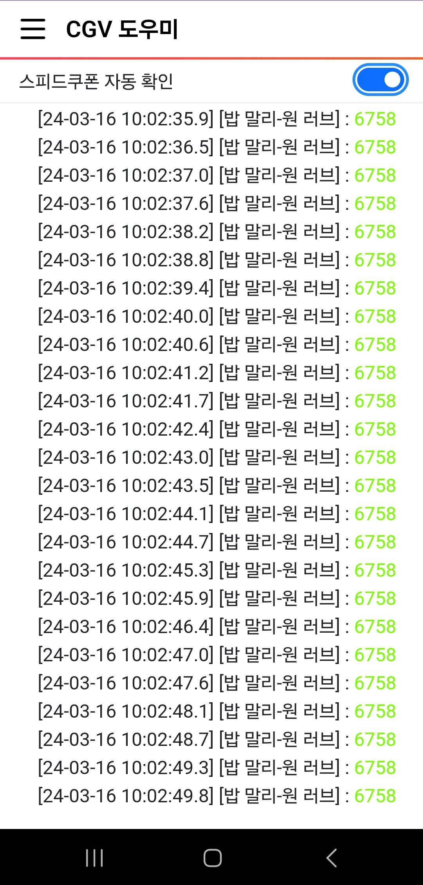

## CGV 도우미
 - 극장별 특전 수량 확인
 - 이벤트 페이지 검색 기능 추가
 - 스피드쿠폰 취소표 알림
 - 서프라이즈 쿠폰 취소표 알림
 - 영화 예매 오픈 알림
 - 반응형 UI 지원
 

  
  

  
  
  
  

## 지원 운영 체제
- Windows  
  .net 8.0 런타임이 필요합니다.

- Android  
  Android 12(API Level 31) 이상

- IOS  
  IOS 17 이상

- Mac Catalyst

 CGV 도우미 앱은 CGV와 제휴 관계가 없으며, CGV의 공식적인 애플리케이션이 아닙니다. 이 애플리케이션은 CGV 이용자들을 위한 보조 도구로써 제공되며, CGV와는 별도의 연관성이 없습니다.